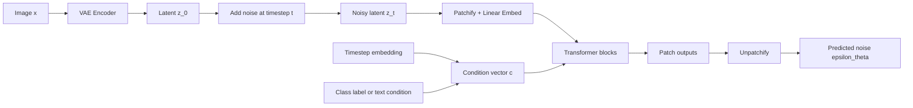
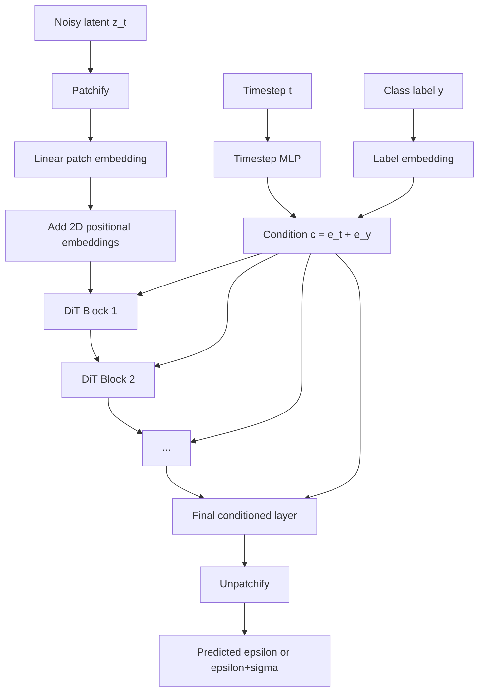
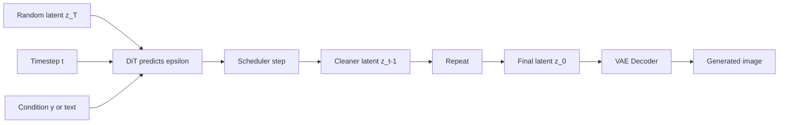

# Diffusion Transformers (DiT)

DiT is one of those ideas that feels obvious only after you see it:

> If diffusion models are so strong, and Transformers are so strong, why not use a Transformer as the diffusion backbone?

That is exactly the point of **Diffusion Transformers (DiT)**. Instead of using a convolutional **U-Net** to predict noise, DiT uses a **Transformer** that works on **patches of latent features**.

This lecture explains:

- what problem DiT solves,
- how the model is structured,
- how conditioning enters the network,
- what the training loss means,
- how to implement a compact DiT-style model and training loop in PyTorch.

It is meant to be beginner friendly, but we will still keep the math honest.

## Why DiT Was Exciting

Classic diffusion models often use a U-Net denoiser. That works well, but modern deep learning has repeatedly shown that **Transformers scale beautifully** when compute and data grow.

The DiT paper asked a practical question:

- keep the diffusion framework,
- keep the latent-diffusion trick,
- replace the denoising backbone with a Transformer,
- see whether scaling laws improve.

The answer was yes: larger DiT models with more compute achieved better sample quality, measured by lower FID.


> Official DiT teaser image from the project page. The original paper trains class-conditional latent diffusion models on ImageNet and shows that Transformer backbones can generate high-quality images.

## The Big Idea in One Sentence

DiT does **diffusion in latent space**, but instead of denoising with a U-Net, it:

1. turns the latent into a grid of patches,
2. embeds those patches into tokens,
3. runs Transformer blocks over the token sequence,
4. predicts the noise (and optionally variance) needed for the reverse diffusion step.

So the backbone changes, but the diffusion objective stays largely the same.

## Where DiT Sits in the Generative Model Family

If you already understand **DDPM** and **Stable Diffusion**, DiT becomes much easier:

- **DDPM**: diffusion in pixel space, often with a U-Net.
- **Stable Diffusion / latent diffusion**: diffusion in compressed latent space, still usually with a U-Net.
- **DiT**: diffusion in latent space, but with a **Transformer denoiser**.

That is why DiT is best thought of as:

!!! note "Mental model"
    Stable Diffusion-style latent diffusion, but the denoiser is a patch-based Transformer rather than a convolutional U-Net.

## Visual Pipeline



## Why Latent Space Matters

A raw `256 x 256 x 3` image contains a lot of pixels. Running full self-attention directly on image patches at that scale would be expensive.

DiT avoids that by first encoding the image with a VAE:

$$
z_0 = \mathcal{E}(x)
$$

For example, a `256 x 256` image may become a latent tensor around:

$$
z_0 \in \mathbb{R}^{4 \times 32 \times 32}
$$

This does two useful things:

- it makes diffusion cheaper,
- it lets the Transformer focus more on semantics and less on raw pixel bookkeeping.

## Step 1: Forward Diffusion in Latent Space

Just like DDPM, we corrupt a clean latent $z_0$ into a noisy latent $z_t$:

$$
z_t = \sqrt{\bar{\alpha}_t}\, z_0 + \sqrt{1 - \bar{\alpha}_t}\, \epsilon,
\qquad \epsilon \sim \mathcal{N}(0, I)
$$

where:

- $t \in \{1, \dots, T\}$ is the timestep,
- $\alpha_t = 1 - \beta_t$,
- $\bar{\alpha}_t = \prod_{s=1}^{t} \alpha_s$.

Interpretation:

- small $t$: mildly noisy latent,
- large $t$: almost pure Gaussian noise.

The learning problem is to reverse this corruption process.

## Step 2: Patchify the Noisy Latent

This is the ViT-like move.

Suppose:

$$
z_t \in \mathbb{R}^{C \times H \times W}
$$

and we use latent patch size $p \times p$. Then:

- each patch contains $p^2 C$ numbers,
- the number of tokens is

$$
N = \frac{HW}{p^2}
$$

Each flattened patch is linearly projected into a hidden embedding of dimension $D$.

So the noisy latent becomes a token sequence:

$$
z_t \longrightarrow X_t \in \mathbb{R}^{N \times D}
$$

This is exactly the same spirit as ViT, except the input is not the original image. It is the **noisy latent** of the image.

## Step 3: Add Positional Information

A Transformer does not know spatial location by default. If you shuffle the tokens, it sees the same set of vectors.

So DiT adds **2D positional embeddings**:

$$
X_t^{(0)} = \text{PatchEmbed}(z_t) + P
$$

where $P$ is a positional embedding matrix.

In the official implementation, these are fixed **2D sine-cosine position embeddings**, not learned position embeddings.

## Step 4: Inject the Diffusion Timestep and Condition

Diffusion models need to know more than just the noisy input.

They also need:

- the timestep $t$,
- a condition such as a class label $y$ or text embedding.

In the original DiT paper, the setup is **class-conditional ImageNet generation**, so the condition is a class label.

The official DiT code computes:

$$
c = e_t + e_y
$$

where:

- $e_t$ is the embedded timestep,
- $e_y$ is the embedded class label.

This gives one conditioning vector per example.

Later text-to-image Transformer diffusion models generalize this idea using text tokens or cross-attention, but the original DiT paper keeps the conditioning mechanism surprisingly simple.

## The DiT Block

The DiT block is close to a standard Transformer block, but it has one crucial modification:

- **adaptive layer normalization with zero initialization**, often called **adaLN-Zero**.

Why is that useful?

- it lets the condition control the block,
- it stabilizes training,
- it makes each block start close to an identity mapping.


> Official block-design figure from the DiT project page. The key takeaway is that conditioning is injected through adaptive layer normalization, and the best-performing variant is the one used in the final DiT architecture.

### What adaLN-Zero Does

A standard Transformer block might look like:

1. LayerNorm
2. Self-attention
3. Residual add
4. LayerNorm
5. MLP
6. Residual add

DiT changes this by letting the condition vector $c$ produce:

- shift terms,
- scale terms,
- residual gates.

So instead of a plain normalization, the block computes something like:

$$
\text{modulate}(h, s, b) = h \odot (1 + s) + b
$$

Then the conditioned block becomes:

$$
x \leftarrow x + g_{\text{msa}} \cdot \text{MSA}(\text{modulate}(\text{LN}(x), s_{\text{msa}}, b_{\text{msa}}))
$$

$$
x \leftarrow x + g_{\text{mlp}} \cdot \text{MLP}(\text{modulate}(\text{LN}(x), s_{\text{mlp}}, b_{\text{mlp}}))
$$

This is a neat design:

- the Transformer stays mostly standard,
- the condition flows into every block,
- the zero initialization keeps early training stable.

## Full DiT Architecture

At a high level, the model is:

1. **Patch embedding** for noisy latent patches.
2. **2D positional embedding** added to tokens.
3. **Timestep embedding**.
4. **Condition embedding** (class label in the original paper).
5. A stack of **DiT blocks** with self-attention and MLP layers.
6. A final conditioned projection layer.
7. **Unpatchify** to reconstruct a latent-shaped output.



## Why Patch Size Matters

One of the most interesting DiT findings is that **smaller latent patches can improve performance** because they produce more tokens.

If you halve the patch size, you roughly quadruple the number of tokens:

- more tokens,
- more self-attention compute,
- more expressive modeling capacity.

This is why names like `DiT-XL/2` matter:

- `XL` refers to the model size,
- `/2` means patch size 2 in latent space.

The paper emphasizes that **Gflops**, not just parameter count, is strongly tied to quality.


> Official scaling figure from the DiT project page. The main lesson is simple: as DiT gets more compute, sample quality improves.


> Another official figure showing that training compute and model complexity are central to understanding DiT performance.

## What Does the Model Predict?

The most beginner-friendly version is:

$$
\epsilon_\theta(z_t, t, y)
$$

which means the model predicts the Gaussian noise that was added.

In the official implementation, `learn_sigma=True` means the network can also predict a variance-related output. That is why the output channel count can be doubled:

- first part: predicted noise,
- second part: predicted variance parameters.

If you are learning the idea for the first time, it is perfectly fine to think of DiT as **predicting noise**. That already captures the main training objective.

## The Core Training Loss

This is the heart of DiT, and the good news is: it is basically the same diffusion loss you already know.

First sample:

- a clean latent $z_0$,
- a timestep $t$,
- random Gaussian noise $\epsilon$.

Construct:

$$
z_t = \sqrt{\bar{\alpha}_t}\, z_0 + \sqrt{1-\bar{\alpha}_t}\, \epsilon
$$

Then ask the model to predict $\epsilon$:

$$
\hat{\epsilon} = \epsilon_\theta(z_t, t, y)
$$

Train with mean-squared error:

$$
\mathcal{L}_{\text{simple}}
=
\mathbb{E}_{z_0, \epsilon, t, y}
\left[
\left\|
\epsilon - \epsilon_\theta(z_t, t, y)
\right\|_2^2
\right]
$$

### Intuition for the Loss

The target noise $\epsilon$ is known because **we added it ourselves**.

So training is a supervised denoising problem:

- input: noisy latent $z_t$ plus timestep and condition,
- target: the exact noise that produced it.

Once the model learns this for all noise levels, a sampler can use the predictions to move from random noise back toward a clean sample.

## Why This Loss Makes Sense

A common beginner question is:

> Why predict noise instead of the clean image directly?

Three reasons:

1. The diffusion derivation becomes simple and stable.
2. The target distribution stays well behaved across timesteps.
3. Empirically, noise prediction works very well.

Some later diffusion models use:

- $x_0$ prediction,
- velocity (`v`) prediction,
- hybrid losses.

But DiT’s central contribution is the **Transformer backbone**, not a radically new diffusion objective.

## Classifier-Free Guidance Training Trick

The original DiT also uses **classifier-free guidance (CFG)**.

During training, the class label is sometimes dropped:

$$
y' =
\begin{cases}
y, & \text{with probability } 1-p \\
\varnothing, & \text{with probability } p
\end{cases}
$$

This teaches the same model to handle both:

- conditional denoising,
- unconditional denoising.

At inference time, combine both predictions:

$$
\hat{\epsilon}_{\text{cfg}}
=
\epsilon_\theta(z_t, t, \varnothing)
+
s\left(
\epsilon_\theta(z_t, t, y)
- \epsilon_\theta(z_t, t, \varnothing)
\right)
$$

where $s$ is the guidance scale.

Interpretation:

- `s = 1`: little or no extra guidance,
- moderate `s`: better alignment with the condition,
- too large `s`: oversaturated or unnatural samples.

## Sampling with DiT

After training, generation works like any diffusion model:

1. start from random Gaussian latent $z_T$,
2. repeatedly predict noise with DiT,
3. use the sampler to compute $z_{t-1}$ from $z_t$,
4. decode the final clean latent through the VAE decoder.



## What Makes DiT Different from a U-Net

### U-Net Strengths

- strong locality bias,
- multiscale hierarchy built in,
- very effective and well tested.

### DiT Strengths

- cleaner scaling behavior,
- architecture closer to the Transformer ecosystem,
- patch-token formulation aligns well with modern foundation-model thinking.

### Trade-off

A U-Net "knows" more about images from its design. A DiT relies more on scale, compute, and learned token interactions.

That is why DiT feels philosophically similar to ViT:

- fewer built-in image assumptions,
- more reliance on data and compute.

## Compact PyTorch Example: a Mini DiT Block

The official DiT implementation is excellent, but here is a smaller educational version showing the key ideas.

```python
import math
import torch
import torch.nn as nn


def modulate(x, shift, scale):
    return x * (1 + scale.unsqueeze(1)) + shift.unsqueeze(1)


class TimestepEmbedder(nn.Module):
    def __init__(self, hidden_size, freq_dim=256):
        super().__init__()
        self.freq_dim = freq_dim
        self.mlp = nn.Sequential(
            nn.Linear(freq_dim, hidden_size),
            nn.SiLU(),
            nn.Linear(hidden_size, hidden_size),
        )

    def sinusoidal_embedding(self, t):
        half = self.freq_dim // 2
        freqs = torch.exp(
            -math.log(10000) * torch.arange(half, device=t.device) / half
        )
        args = t[:, None].float() * freqs[None]
        emb = torch.cat([torch.cos(args), torch.sin(args)], dim=-1)
        if self.freq_dim % 2 == 1:
            emb = torch.cat([emb, torch.zeros_like(emb[:, :1])], dim=-1)
        return emb

    def forward(self, t):
        return self.mlp(self.sinusoidal_embedding(t))


class DiTBlock(nn.Module):
    def __init__(self, dim, num_heads, mlp_ratio=4.0):
        super().__init__()
        self.norm1 = nn.LayerNorm(dim, elementwise_affine=False)
        self.attn = nn.MultiheadAttention(dim, num_heads, batch_first=True)
        self.norm2 = nn.LayerNorm(dim, elementwise_affine=False)
        self.mlp = nn.Sequential(
            nn.Linear(dim, int(dim * mlp_ratio)),
            nn.GELU(),
            nn.Linear(int(dim * mlp_ratio), dim),
        )
        self.adaLN = nn.Sequential(
            nn.SiLU(),
            nn.Linear(dim, 6 * dim)
        )

    def forward(self, x, c):
        shift1, scale1, gate1, shift2, scale2, gate2 = self.adaLN(c).chunk(6, dim=-1)
        h = modulate(self.norm1(x), shift1, scale1)
        attn_out, _ = self.attn(h, h, h, need_weights=False)
        x = x + gate1.unsqueeze(1) * attn_out

        h = modulate(self.norm2(x), shift2, scale2)
        x = x + gate2.unsqueeze(1) * self.mlp(h)
        return x
```

## Compact PyTorch Example: a Mini DiT Model

This version uses:

- patch embedding by convolution,
- fixed token sequence processing,
- timestep and label conditioning,
- Transformer blocks,
- patch reconstruction at the end.

```python
import torch
import torch.nn as nn


class MiniDiT(nn.Module):
    def __init__(
        self,
        in_channels=4,
        patch_size=2,
        hidden_size=384,
        depth=8,
        num_heads=6,
        num_classes=1000,
        latent_size=32,
    ):
        super().__init__()
        self.patch_size = patch_size
        self.in_channels = in_channels
        self.latent_size = latent_size

        self.patch_embed = nn.Conv2d(
            in_channels, hidden_size,
            kernel_size=patch_size,
            stride=patch_size
        )

        num_tokens = (latent_size // patch_size) ** 2
        self.pos_embed = nn.Parameter(torch.randn(1, num_tokens, hidden_size) * 0.02)

        self.t_embed = TimestepEmbedder(hidden_size)
        self.y_embed = nn.Embedding(num_classes + 1, hidden_size)  # extra token for dropped label

        self.blocks = nn.ModuleList([
            DiTBlock(hidden_size, num_heads) for _ in range(depth)
        ])

        self.final_norm = nn.LayerNorm(hidden_size)
        self.final_proj = nn.Linear(hidden_size, patch_size * patch_size * in_channels)

    def patchify(self, x):
        x = self.patch_embed(x)                  # [B, D, H', W']
        x = x.flatten(2).transpose(1, 2)        # [B, T, D]
        return x

    def unpatchify(self, x):
        B, T, P = x.shape
        h = w = int(T ** 0.5)
        p = self.patch_size
        c = self.in_channels
        x = x.view(B, h, w, p, p, c)
        x = torch.einsum("nhwpqc->nchpwq", x)
        x = x.reshape(B, c, h * p, w * p)
        return x

    def forward(self, z_t, t, y):
        x = self.patchify(z_t) + self.pos_embed
        c = self.t_embed(t) + self.y_embed(y)

        for block in self.blocks:
            x = block(x, c)

        x = self.final_proj(self.final_norm(x))
        return self.unpatchify(x)
```

## Training Code Template

This example assumes:

- images are encoded into latents by a pretrained VAE,
- the model predicts noise,
- labels are used for class conditioning,
- label dropout enables classifier-free guidance.

```python
import torch
import torch.nn.functional as F


def q_sample(z0, t, alpha_bar):
    noise = torch.randn_like(z0)
    a = alpha_bar[t].view(-1, 1, 1, 1)
    zt = torch.sqrt(a) * z0 + torch.sqrt(1 - a) * noise
    return zt, noise


def training_step(model, vae, images, labels, alpha_bar, num_classes, drop_prob=0.1):
    device = images.device

    with torch.no_grad():
        z0 = vae.encode(images).latent_dist.sample() * 0.18215

    t = torch.randint(0, len(alpha_bar), (images.size(0),), device=device)
    zt, noise = q_sample(z0, t, alpha_bar)

    # Classifier-free guidance label dropout
    drop_mask = (torch.rand(labels.shape, device=device) < drop_prob)
    labels = torch.where(drop_mask, torch.full_like(labels, num_classes), labels)

    noise_pred = model(zt, t, labels)
    loss = F.mse_loss(noise_pred, noise)
    return loss
```

And a minimal optimizer loop:

```python
optimizer = torch.optim.AdamW(model.parameters(), lr=1e-4, weight_decay=0.0)

for images, labels in train_loader:
    images = images.to(device)
    labels = labels.to(device)

    optimizer.zero_grad()
    loss = training_step(model, vae, images, labels, alpha_bar, num_classes=1000)
    loss.backward()
    optimizer.step()

    print(f"loss: {loss.item():.4f}")
```

## Sample Quality and Scaling

One of the most important scientific messages of the DiT paper is not just "Transformers work."

It is:

> DiT quality improves in a very clean way as compute increases.

That makes DiT feel like part of the broader foundation-model story:

- bigger models,
- more tokens,
- more training compute,
- better generative quality.


> Official sample grid from the DiT repository.


> Additional official sample grid from the DiT repository.

## Why DiT Influenced Later Models

DiT mattered because it suggested a broader principle:

- diffusion does not need to be married to convolutional U-Nets,
- patch-based Transformers can be strong generative backbones,
- scaling behavior can be a central design lens.

That idea influenced later text-to-image and multimodal systems built around Transformer-style diffusion backbones.

## Beginner Recap

If you only remember six things, remember these:

1. DiT is a **diffusion model backbone**, not a brand-new diffusion objective.
2. It usually works in **latent space**, not raw pixels.
3. It turns noisy latent patches into **Transformer tokens**.
4. It injects timestep and condition using **adaLN-Zero**.
5. It is trained with the familiar **noise-prediction MSE loss**.
6. Its headline strength is **scaling with compute**.

## References and Further Reading

- Peebles and Xie, [Scalable Diffusion Models with Transformers](https://arxiv.org/abs/2212.09748), *ICCV* 2023.
- Official project page: [DiT](https://www.wpeebles.com/DiT).
- Official implementation: [facebookresearch/DiT](https://github.com/facebookresearch/DiT).
- Hugging Face `diffusers` documentation for DiT-related pipelines and Transformer-based diffusion backbones.
