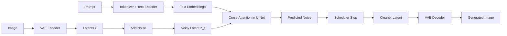

# Stable Diffusion: A Practical Math-to-Code Tutorial

Stable Diffusion feels a bit like hiring a very patient painter who starts from television static and, one denoising step at a time, turns it into "a corgi wearing a lab coat in watercolor style." The surprising part is that the model does not paint directly in pixel space. Instead, it works in a compressed **latent space**, which is the main trick that makes high-resolution diffusion practical.

This tutorial explains the mathematical principle behind Stable Diffusion, its architecture, the main training losses, and code templates for loading data, training, and sampling.

## Why Stable Diffusion Was a Big Deal

Classic diffusion models are powerful, but pixel-space generation is expensive. If you try to denoise a large image directly, memory and compute costs rise quickly. Stable Diffusion solves this by pushing the diffusion process into a smaller latent representation:

$$
x \in \mathbb{R}^{H \times W \times 3}
\quad \longrightarrow \quad
z = \mathcal{E}(x) \in \mathbb{R}^{h \times w \times c},
\quad h \ll H,\; w \ll W
$$

Instead of learning to denoise full images, the model learns to denoise the latent code $z$. After sampling, a decoder maps the cleaned latent back to pixels:

$$
\hat{x} = \mathcal{D}(z_0)
$$

This is why Stable Diffusion can make detailed images without needing the compute budget of a small moon mission.


> Public architecture figure from Wikimedia Commons, adapted from the Latent Diffusion work.

## The Core Idea in One Pipeline

Stable Diffusion has three main learned components:

1. **VAE**: compresses an image into a latent and decodes the latent back to pixels.
2. **Text encoder**: turns a prompt into token embeddings.
3. **U-Net denoiser**: predicts the noise inside a noisy latent while attending to the text.



## Mathematical Principle

### 1. Compress Images into Latent Space

Let $\mathcal{E}$ be the VAE encoder and $\mathcal{D}$ be the decoder. For an input image $x$:

$$
z_0 \sim q_{\phi}(z \mid x), \qquad \hat{x} = \mathcal{D}_{\phi}(z_0)
$$

The latent $z_0$ is much smaller than $x$, but should still preserve semantics such as shape, layout, and texture.

### 2. Forward Diffusion in Latent Space

Stable Diffusion uses a DDPM-style forward process, but on latents instead of pixels:

$$
z_t = \sqrt{\bar{\alpha}_t}\, z_0 + \sqrt{1-\bar{\alpha}_t}\, \epsilon,
\qquad \epsilon \sim \mathcal{N}(0, I)
$$

where:

- $\alpha_t = 1 - \beta_t$
- $\bar{\alpha}_t = \prod_{s=1}^t \alpha_s$
- $t \in \{1, \dots, T\}$

At large $t$, $z_t$ looks nearly Gaussian.

### 3. Learn the Reverse Process

The U-Net is trained to predict the noise that was added:

$$
\epsilon_{\theta}(z_t, t, c)
$$

where $c$ is the conditioning signal, usually the prompt embedding from the text encoder.

If the model can estimate $\epsilon$, then the sampler can iteratively walk from noisy latent $z_T$ back to a clean latent $z_0$.

### 4. Text Conditioning via Cross-Attention

The text prompt is tokenized and encoded into a sequence of hidden states:

$$
c = \text{TextEncoder}(\text{prompt})
$$

Inside the U-Net, cross-attention lets each spatial feature location attend to prompt tokens. Intuitively, the model can decide when to care about "red", "microscope", or "oil painting" instead of smearing all words into one vector soup.

## Architecture Details

### VAE: the compression engine

The VAE has two jobs:

- **Encoder**: map image $x$ to latent $z$
- **Decoder**: map latent $z$ back to image space

Why this matters:

- Diffusion becomes cheaper because the spatial grid is much smaller.
- The denoiser can spend more capacity on semantic structure instead of raw pixel bookkeeping.

In the original latent diffusion setup, a $512 \times 512$ RGB image is compressed to a latent with much smaller spatial size, often around `4 x 64 x 64`.

### Text Encoder: prompt to embeddings

Stable Diffusion v1 commonly uses a frozen CLIP text encoder. The prompt is converted into token embeddings, usually padded or truncated to a fixed token length.

Why freeze it?

- It already knows a lot about image-text alignment.
- Training becomes cheaper and more stable.
- The diffusion model only needs to learn how to use the embeddings, not reinvent language understanding from scratch.

### U-Net: the denoising workhorse

The U-Net takes:

- noisy latent $z_t$
- timestep embedding $t$
- text conditioning $c$

and outputs a prediction of the injected noise.

The U-Net usually contains:

- convolutional residual blocks
- downsampling and upsampling paths
- skip connections
- self-attention and cross-attention blocks
- timestep embeddings injected into residual blocks

The down path captures large context, the bottleneck mixes global information, and the up path restores spatial detail. Skip connections help preserve useful structure while denoising.

### Scheduler: the reverse-time navigator

The scheduler is not the neural network itself. It defines how to move from $z_t$ to $z_{t-1}$ after the U-Net predicts noise. Different schedulers such as DDPM, DDIM, Euler, and DPM-Solver trade off speed, stochasticity, and sample quality.

This is why changing the scheduler can alter image style and sharpness even when the learned model weights stay the same.

## Training Losses

Stable Diffusion is really a two-stage story: first learn the latent space, then learn diffusion inside it.

### Stage 1: VAE loss

The autoencoder is trained to reconstruct images while regularizing the latent distribution:

$$
\mathcal{L}_{\text{VAE}}
= \lambda_{\text{rec}} \, \|x - \hat{x}\|_1
+ \lambda_{\text{perc}} \, \mathcal{L}_{\text{perceptual}}(x, \hat{x})
+ \beta \, D_{\mathrm{KL}}\!\left(q_{\phi}(z \mid x)\,\|\,\mathcal{N}(0,I)\right)
$$

Interpretation:

- reconstruction loss keeps the decoded image faithful
- perceptual loss preserves visual quality better than raw pixels alone
- KL regularization keeps the latent space smooth enough to sample and denoise

### Stage 2: latent diffusion loss

Once the VAE is trained, encode the image into a latent $z_0$ and train the denoiser with:

$$
\mathcal{L}_{\text{diffusion}}
=
\mathbb{E}_{z_0, \epsilon, t, c}
\left[
\left\|
\epsilon - \epsilon_{\theta}(z_t, t, c)
\right\|_2^2
\right]
$$

where

$$
z_t = \sqrt{\bar{\alpha}_t}\, z_0 + \sqrt{1-\bar{\alpha}_t}\, \epsilon
$$

This is the standard noise-prediction objective. Some later models use $x_0$-prediction or $v$-prediction, but the intuition stays the same: teach the denoiser how to undo corruption at any noise level.

### Classifier-Free Guidance loss trick

To make prompts matter more, Stable Diffusion uses **classifier-free guidance**. During training, some prompts are dropped and replaced with an empty condition:

$$
c =
\begin{cases}
\varnothing, & \text{with probability } p_{\text{drop}} \\
\text{TextEncoder}(\text{prompt}), & \text{otherwise}
\end{cases}
$$

The model therefore learns both conditional and unconditional denoising in one network.

At sampling time, combine the two predictions:

$$
\hat{\epsilon}
= \epsilon_{\theta}(z_t, t, \varnothing)
+ s \left[
\epsilon_{\theta}(z_t, t, c)
- \epsilon_{\theta}(z_t, t, \varnothing)
\right]
$$

where $s$ is the guidance scale.

Rule of thumb:

- small `guidance_scale`: more diversity, weaker prompt adherence
- medium `guidance_scale` such as `5-8`: good balance
- very large `guidance_scale`: prompt-following becomes stronger, but artifacts can appear

## A Minimal Training Recipe

If you want to fine-tune Stable Diffusion on a captioned dataset, the standard workflow is:

1. Load image-caption pairs.
2. Freeze the VAE and text encoder.
3. Encode images into latents with the VAE.
4. Tokenize captions and obtain text embeddings.
5. Add random noise to latents at random timesteps.
6. Train the U-Net to predict that noise.
7. Sample from the trained checkpoint with a scheduler.

This is already enough for a strong first fine-tuning baseline.


> Public Wikimedia Commons example showing how a text-to-image diffusion model can be specialized through fine-tuning.

## Code Template: Data

This template assumes a local folder with images and captions in a CSV file.

```python
import os
import pandas as pd
from PIL import Image
from torch.utils.data import Dataset, DataLoader
from torchvision import transforms


class ImageCaptionDataset(Dataset):
    def __init__(self, csv_path: str, image_root: str, tokenizer, size: int = 512):
        self.df = pd.read_csv(csv_path)
        self.image_root = image_root
        self.tokenizer = tokenizer
        self.transform = transforms.Compose([
            transforms.Resize(size, interpolation=transforms.InterpolationMode.BILINEAR),
            transforms.CenterCrop(size),
            transforms.ToTensor(),
            transforms.Normalize([0.5, 0.5, 0.5], [0.5, 0.5, 0.5]),
        ])

    def __len__(self):
        return len(self.df)

    def __getitem__(self, idx):
        row = self.df.iloc[idx]
        image = Image.open(os.path.join(self.image_root, row["image"])).convert("RGB")
        image = self.transform(image)

        text = row["caption"]
        tokens = self.tokenizer(
            text,
            max_length=self.tokenizer.model_max_length,
            padding="max_length",
            truncation=True,
            return_tensors="pt",
        )

        return {
            "pixel_values": image,
            "input_ids": tokens.input_ids[0],
            "attention_mask": tokens.attention_mask[0],
            "caption": text,
        }
```

## Code Template: Model Load

This template uses the Hugging Face `diffusers` and `transformers` ecosystem.

```python
import torch
from diffusers import AutoencoderKL, DDPMScheduler, UNet2DConditionModel
from transformers import CLIPTextModel, CLIPTokenizer


device = "cuda" if torch.cuda.is_available() else "cpu"
model_id = "runwayml/stable-diffusion-v1-5"

tokenizer = CLIPTokenizer.from_pretrained(model_id, subfolder="tokenizer")
text_encoder = CLIPTextModel.from_pretrained(model_id, subfolder="text_encoder").to(device)
vae = AutoencoderKL.from_pretrained(model_id, subfolder="vae").to(device)
unet = UNet2DConditionModel.from_pretrained(model_id, subfolder="unet").to(device)
noise_scheduler = DDPMScheduler.from_pretrained(model_id, subfolder="scheduler")

# Common fine-tuning setup: only train the U-Net.
vae.requires_grad_(False)
text_encoder.requires_grad_(False)
unet.train()
```

## Code Template: Training Loop

This is the essential latent-diffusion training loop. It is intentionally simple so the moving parts are visible.

```python
import random
import torch
import torch.nn.functional as F
from torch.optim import AdamW


optimizer = AdamW(unet.parameters(), lr=1e-5, weight_decay=1e-2)
cfg_dropout = 0.1

for batch in dataloader:
    pixel_values = batch["pixel_values"].to(device)
    input_ids = batch["input_ids"].to(device)

    with torch.no_grad():
        # Encode image to latent space.
        latents = vae.encode(pixel_values).latent_dist.sample()
        latents = latents * vae.config.scaling_factor

        # Randomly drop text conditioning for classifier-free guidance training.
        if random.random() < cfg_dropout:
            empty = tokenizer(
                [""] * input_ids.shape[0],
                max_length=tokenizer.model_max_length,
                padding="max_length",
                truncation=True,
                return_tensors="pt",
            )
            input_ids = empty.input_ids.to(device)

        encoder_hidden_states = text_encoder(input_ids)[0]

    noise = torch.randn_like(latents)
    timesteps = torch.randint(
        0,
        noise_scheduler.config.num_train_timesteps,
        (latents.shape[0],),
        device=device,
    ).long()

    noisy_latents = noise_scheduler.add_noise(latents, noise, timesteps)
    noise_pred = unet(
        noisy_latents,
        timesteps,
        encoder_hidden_states=encoder_hidden_states,
    ).sample

    loss = F.mse_loss(noise_pred.float(), noise.float(), reduction="mean")

    optimizer.zero_grad(set_to_none=True)
    loss.backward()
    optimizer.step()

    print(f"loss={loss.item():.4f}")
```

### Practical notes

- Fine-tuning the whole model is expensive; many workflows train only the U-Net or LoRA adapters.
- Mixed precision and gradient accumulation are usually necessary on limited GPUs.
- Caption quality matters a lot. If captions are vague, the model learns vague associations.
- For domain adaptation, keep prompts close to the visual content you actually want the model to learn.

## Code Template: Sampling with a Pipeline

The easiest way to sample is through a high-level pipeline:

```python
import torch
from diffusers import StableDiffusionPipeline, DPMSolverMultistepScheduler


pipe = StableDiffusionPipeline.from_pretrained(
    "runwayml/stable-diffusion-v1-5",
    torch_dtype=torch.float16,
).to("cuda")

pipe.scheduler = DPMSolverMultistepScheduler.from_config(pipe.scheduler.config)

prompt = "a glowing jellyfish floating in a glass laboratory, cinematic lighting"
negative_prompt = "blurry, low quality, distorted anatomy"

image = pipe(
    prompt=prompt,
    negative_prompt=negative_prompt,
    num_inference_steps=30,
    guidance_scale=7.5,
    height=512,
    width=512,
).images[0]

image.save("stable_diffusion_sample.png")
```

## Code Template: Sampling Step-by-Step

If you want to see the reverse process more explicitly, here is the low-level structure:

```python
import torch


prompt = "a watercolor painting of a fox reading a medical textbook"
batch_size = 1
guidance_scale = 7.5
num_inference_steps = 30

text_inputs = tokenizer(
    [prompt],
    padding="max_length",
    max_length=tokenizer.model_max_length,
    truncation=True,
    return_tensors="pt",
)
uncond_inputs = tokenizer(
    [""],
    padding="max_length",
    max_length=tokenizer.model_max_length,
    return_tensors="pt",
)

with torch.no_grad():
    text_embeds = text_encoder(text_inputs.input_ids.to(device))[0]
    uncond_embeds = text_encoder(uncond_inputs.input_ids.to(device))[0]

latents = torch.randn(
    (batch_size, unet.config.in_channels, 64, 64),
    device=device,
) * noise_scheduler.init_noise_sigma

noise_scheduler.set_timesteps(num_inference_steps, device=device)

for t in noise_scheduler.timesteps:
    latent_model_input = torch.cat([latents, latents], dim=0)
    embeds = torch.cat([uncond_embeds, text_embeds], dim=0)

    with torch.no_grad():
        noise_pred = unet(
            latent_model_input,
            t,
            encoder_hidden_states=embeds,
        ).sample

    noise_uncond, noise_text = noise_pred.chunk(2)
    noise_guided = noise_uncond + guidance_scale * (noise_text - noise_uncond)
    latents = noise_scheduler.step(noise_guided, t, latents).prev_sample

with torch.no_grad():
    latents = latents / vae.config.scaling_factor
    image = vae.decode(latents).sample

image = (image / 2 + 0.5).clamp(0, 1)
image = image.cpu().permute(0, 2, 3, 1).numpy()[0]
```
