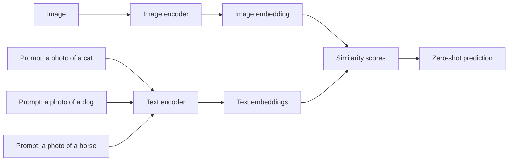

# CLIP: Contrastive Language-Image Pretraining

## Why CLIP Felt Magical

Before CLIP, image models were usually trained to choose among a fixed label set:

- cat,
- dog,
- airplane,
- toaster,
- your dignity after debugging a shape mismatch.

CLIP changed the game by learning from **image-text pairs**. Instead of asking:

> "Which class ID is correct?"

it asks:

> "Which caption goes with this image?"

That sounds like a small change, but it makes the learned encoder much more flexible.


> Official CLIP figure from the OpenAI repository. The model jointly learns an image encoder and a text encoder so matching image-text pairs have similar embeddings.

## The Basic Setup

CLIP has two encoders:

- an image encoder $f_\theta(x)$,
- a text encoder $g_\phi(t)$.

For an image $x_i$ and caption $t_i$, the model produces:

$$
v_i = f_\theta(x_i), \qquad u_i = g_\phi(t_i)
$$

These are usually normalized:

$$
\tilde{v}_i = \frac{v_i}{\|v_i\|}, \qquad
\tilde{u}_i = \frac{u_i}{\|u_i\|}
$$

Then CLIP computes similarity scores:

$$
s_{ij} = \tilde{v}_i^\top \tilde{u}_j
$$

If image $i$ matches text $i$, then $s_{ii}$ should be high.

## Why This Trains a Better Encoder

Language is a rich supervision signal.

A caption might mention:

- object identity,
- color,
- action,
- style,
- context,
- relationships.

So the image encoder is pushed to learn features aligned with meaningful language concepts instead of only one narrow label taxonomy.

That is why CLIP is often described as learning a **shared embedding space** between images and text.

## The CLIP Loss

Given a batch of $N$ image-text pairs, form the similarity matrix:

$$
S \in \mathbb{R}^{N \times N}, \qquad S_{ij} = \frac{\tilde{v}_i^\top \tilde{u}_j}{\tau}
$$

where $\tau$ is a learned or fixed temperature.

Then apply cross-entropy in **both directions**:

### Image-to-text loss

$$
\mathcal{L}_{\text{img}}
=
\frac{1}{N}
\sum_{i=1}^N
-
\log
\frac{\exp(S_{ii})}{\sum_{j=1}^N \exp(S_{ij})}
$$

### Text-to-image loss

$$
\mathcal{L}_{\text{text}}
=
\frac{1}{N}
\sum_{i=1}^N
-
\log
\frac{\exp(S_{ii})}{\sum_{j=1}^N \exp(S_{ji})}
$$

### Final loss

$$
\mathcal{L}_{\text{CLIP}} = \frac{1}{2}\left(\mathcal{L}_{\text{img}} + \mathcal{L}_{\text{text}}\right)
$$

This is a symmetric contrastive objective.

## Intuition for the CLIP Loss

For each image, the correct caption should win against all captions in the batch.

For each caption, the correct image should win against all images in the batch.

So CLIP is basically doing contrastive learning, but the two views come from **different modalities**:

- image,
- text.

That is the brilliant part.

## Zero-Shot Classification

Once the encoders are aligned, classification becomes a text matching problem.

Suppose you want to classify an image among labels:

- "cat"
- "dog"
- "horse"

Instead of training a new classifier head, you can write prompts:

- "a photo of a cat"
- "a photo of a dog"
- "a photo of a horse"

Encode them with the text encoder, compare to the image embedding, and pick the most similar one.



This is why CLIP became so influential. It turned classification into retrieval in a shared embedding space.

## Minimal PyTorch-Style Loss Template

```python
import torch
import torch.nn.functional as F


def clip_loss(image_features, text_features, temperature=0.07):
    image_features = F.normalize(image_features, dim=-1)
    text_features = F.normalize(text_features, dim=-1)

    logits = image_features @ text_features.T / temperature
    labels = torch.arange(logits.size(0), device=logits.device)

    loss_i = F.cross_entropy(logits, labels)
    loss_t = F.cross_entropy(logits.T, labels)
    return 0.5 * (loss_i + loss_t)
```

## Minimal Training Skeleton

```python
for images, tokenized_text in train_loader:
    images = images.to(device)
    tokenized_text = tokenized_text.to(device)

    image_features = image_encoder(images)
    text_features = text_encoder(tokenized_text)

    loss = clip_loss(image_features, text_features)

    optimizer.zero_grad()
    loss.backward()
    optimizer.step()
```

## Hugging Face Example for Inference

```python
import requests
from PIL import Image
from transformers import CLIPModel, AutoProcessor

model = CLIPModel.from_pretrained("openai/clip-vit-base-patch32")
processor = AutoProcessor.from_pretrained("openai/clip-vit-base-patch32")

url = "http://images.cocodataset.org/val2017/000000039769.jpg"
image = Image.open(requests.get(url, stream=True).raw).convert("RGB")
labels = ["a photo of a cat", "a photo of a dog", "a photo of a car"]

inputs = processor(text=labels, images=image, return_tensors="pt", padding=True)
outputs = model(**inputs)
logits = outputs.logits_per_image
probs = logits.softmax(dim=-1)
print(probs)
```

## Why CLIP Is More Than Classification

A CLIP-style encoder can support:

- zero-shot classification,
- retrieval,
- image search,
- text-guided image systems,
- multimodal medical search,
- data curation and clustering.

This is one reason CLIP became foundational for later models.

## CLIP in Medicine

In medical AI, the same idea can be used with image-report pairs:

- chest X-ray + report,
- pathology tile + note,
- retinal image + diagnosis text.

That makes CLIP-style learning attractive for building multimodal medical encoders without handcrafted label taxonomies.

## Limitations

CLIP is powerful, but not magic:

- web captions can be noisy,
- text can encode social bias,
- zero-shot predictions can still be brittle,
- language alignment does not guarantee clinical correctness.

In medicine, this means CLIP-like encoders must be validated carefully before deployment.

## Summary

CLIP takes contrastive learning and gives it language.

- image embeddings and text embeddings are aligned,
- the loss is symmetric cross-entropy over image-text similarities,
- the resulting encoder is flexible enough for zero-shot and multimodal tasks.

That simple idea reshaped vision-language modeling.

## References and Further Reading

- Radford et al., [Learning Transferable Visual Models From Natural Language Supervision](https://arxiv.org/abs/2103.00020), *ICML* 2021.
- Official repository: [openai/CLIP](https://github.com/openai/CLIP).
- Hugging Face docs: [CLIP model documentation](https://huggingface.co/docs/transformers/model_doc/clip).
