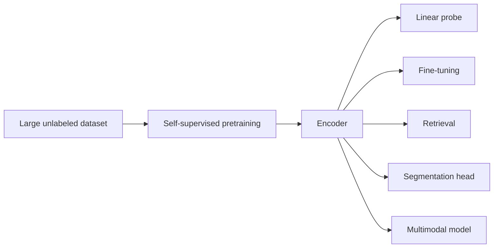

# Why Train an Encoder First?

## The Main Motivation

Imagine you are building a medical imaging system. You may want to classify diabetic retinopathy, detect lesions, retrieve similar scans, or segment anatomy. Training a separate network from scratch for every task is wasteful.

What you really want is a model that has already learned:

- edges and textures,
- shape and layout,
- object parts,
- semantic structure.

That reusable front half of the model is the **encoder**.

## What an Encoder Actually Does

An encoder maps a raw input $x$ into a feature vector or feature map:

$$
z = f_\theta(x)
$$

where:

- $x$ is an image,
- $f_\theta$ is the encoder,
- $z$ is a representation.

The dream is that $z$ keeps the important information and throws away the junk.

For example, we might want the representation to remember:

- "this looks like lung tissue,"
- "this image has vessel-like structures,"
- "these two images are visually similar,"

without overreacting to small nuisances like crop position, lighting, or background clutter.

## Why Labels Are Not the Best Teacher for Everything

Supervised training is powerful, but it only teaches what the labels ask for.

If the dataset label is "cat" vs "dog", the model may never be rewarded for learning:

- material,
- viewpoint,
- texture,
- background context,
- relationships to language.

Self-supervised learning tries to build a broader visual understanding before task-specific supervision narrows it down.

## The Reuse Pattern

The modern workflow often looks like this:

This reuse is why encoder training is such a big deal. Once the encoder is strong, many downstream tasks become easier.

## What Makes a "Good" Representation?

A useful encoder representation should usually have three properties:

### 1. Invariance

Small irrelevant changes should not drastically change the representation.

If I crop an image slightly or flip it, the representation should still say, "yes, same underlying scene."

### 2. Discriminability

Different semantic content should map to different features.

A chest X-ray and a retinal image should not collapse into the same embedding soup.

### 3. Transferability

The features should work across many tasks, not just the one used during pretraining.

This is the part that makes self-supervised learning feel like a "foundation model" story.

## A Simple Downstream Objective

Once the encoder is trained, a very common evaluation is a **linear probe**.

Freeze the encoder and train a small classifier:

$$
\hat{y} = W z + b, \qquad z = f_\theta(x)
$$

If a linear classifier works well, it means the encoder already organized the representation space in a useful way.

That is why papers often report:

- linear evaluation,
- k-NN evaluation,
- retrieval quality,
- dense task transfer.

## Why This Matters in Medicine

Self-supervised encoders are especially attractive in healthcare because:

- unlabeled images are much easier to collect than expert annotations,
- labels may be noisy or inconsistent,
- transfer across hospitals and devices matters,
- one pretrained encoder can support multiple downstream pipelines.

Think about pathology slides, retinal images, ultrasound, or CT. You may have millions of images and only a tiny fraction with reliable labels. Self-supervised learning is designed for exactly this situation.

## Two Big Families We Will Study

This chapter focuses on two especially influential ideas:

### Contrastive Learning

Learn by pulling similar views together and pushing different examples apart.

This includes:

- SimCLR-style image-image contrastive learning,
- CLIP-style image-text contrastive learning.

### Self-Distillation

Learn by making a student network match a teacher network across views, often without explicit negative pairs.

This is the family that leads us to **DINO** and **DINOv2**.

## The Big Picture

If supervised learning says:

> "Here is the correct label."

self-supervised learning says:

> "There is structure hidden in the data. Learn that first."

That shift is why encoder pretraining changed modern vision.

## Summary

The central reason to train an encoder first is simple:

- the world contains much more raw data than labeled data,
- a strong encoder can compress that raw experience into reusable features,
- downstream tasks become cheaper, faster, and often more accurate.

The rest of this chapter shows three major ways to make that happen.

## References and Further Reading

- Chen et al., [A Simple Framework for Contrastive Learning of Visual Representations](https://arxiv.org/abs/2002.05709), *ICML* 2020.
- Radford et al., [Learning Transferable Visual Models From Natural Language Supervision](https://arxiv.org/abs/2103.00020), *ICML* 2021.
- Oquab et al., [DINOv2: Learning Robust Visual Features without Supervision](https://arxiv.org/abs/2304.07193), 2023.
